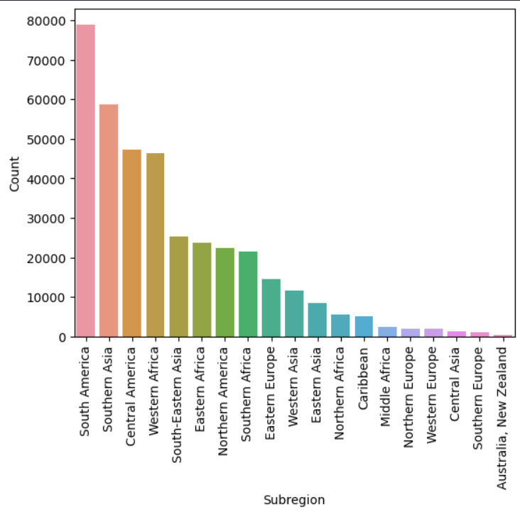

# EDA_Homocide_Data_Analysis

## Introduction 
In this project, it focuses on the process of **Exploratory Data Analysis (EDA)** from our dataset called *homocide_by_countries.csv*. 
This project is guided by a YouTube Channel: [Data Zero From Zero to Hero, Homocide Data Analysis](https://www.youtube.com/watch?v=k4KptgTnVjI&ab_channel=DataFromZerotoHero),
for me to have better understanding the process of EDA as a beginner level experience. 

## Tech Stack
1. Visual Studio Code
2. Jupyter Notebook
3. Python (Pandas, Matplotlib, Plotly, & Seaborn)

## Features
This project shows the process of Exploratory Data Analysis such as how we can put our CSV file into a dataFrame, checking 
our dataFrame contains null values and duplicate rows, and etc. The main feature of our project is our data visualization using 
Seaborn, Plotly, and Matplotlib libraries to gain understanding of what our data is trying to tell us such as which region has the highest
homocide count.

## Process
After learning about the process of EDA, I decided to watch a YouTube video by Data From Zero to Hero to 
gain better understanding of EDA as a beginner level in Data Analyst. Throughout the project, we want to 
look at the basic information such as the shape of the dataFrame (rows, columns), checking for 
missing and duplicate values, and data types of each columns. The rest of the project focuses on creating 
data visualization, for which we do a lot of queries on our dataFrame. 

## learning
What I learn from this project is gaining good understanding the process of EDA, for which it is 
like a step-by-step process of gather basic information, dealing with missing and duplicated values, and lastly
creating queries to filter our data so we can create our data visuals for our findings. 

## Improvement
When I was working on this project, I need to develop my skills on creating queries because there are so
many ways to create queries when trying to make a data visuals, so it can be easier to read for our 
audience. 

## Running the project
You can download the *homocide.ipynb* file, and run it on either Jupyter Notebook, Visual Studio
Code (require Jupyter Notebook extension), and Google Colab. 

